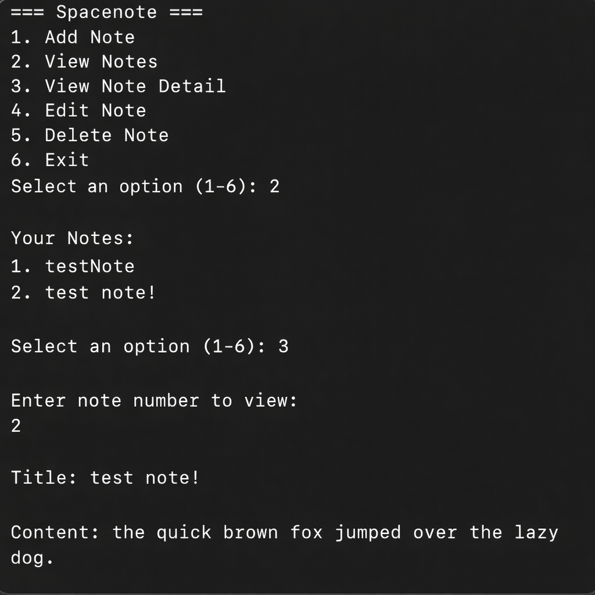

# Python Console Note-Taking App

A simple Python-based console note-taking app.  
Notes are saved to `notes.json` in the same folder as `main.py`, so they persist between sessions.

## Features
- Add, view, edit, and delete notes
- Persistent storage with JSON
- Interactive console menu
- Fully self-contained - no extra setup needed




## How to Run

### Requirements
- Python 3

### Steps
1. Clone the repository
2. Navigate into the project directory
3. Run the program

```bash
git clone https://github.com/yohaann196/spacenote.git
cd spacenote
python main.py   # or python3 main.py
